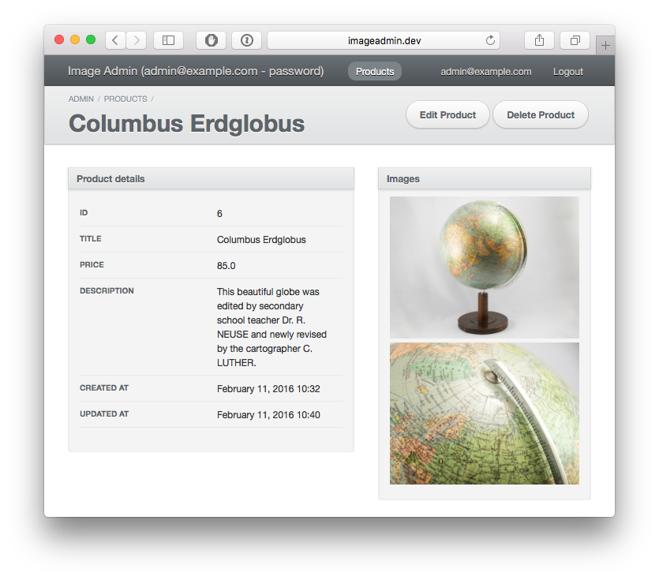
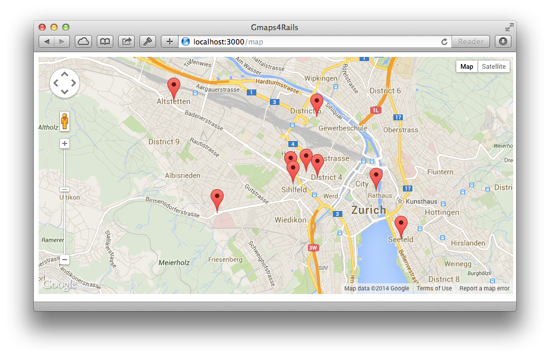

[Rails-quickies][]
------------

Here you find a collection of neat little rails projects. Each of the submodules has a readme with detailed instructions how to create the project.

Feedback is very welcome.                           

[Rails-quickies]: https://github.com/besi/rails-quickies

## [ImageAdmin][]

Upload and manage multiple images per product-entity using [ActiveAdmin](http://activeadmin.info)

[ImageAdmin]: ImageAdmin

## [Gmaps4Rails][]

Display a set of contacts on a map

[Gmaps4Rails]: Gmaps4Rails
